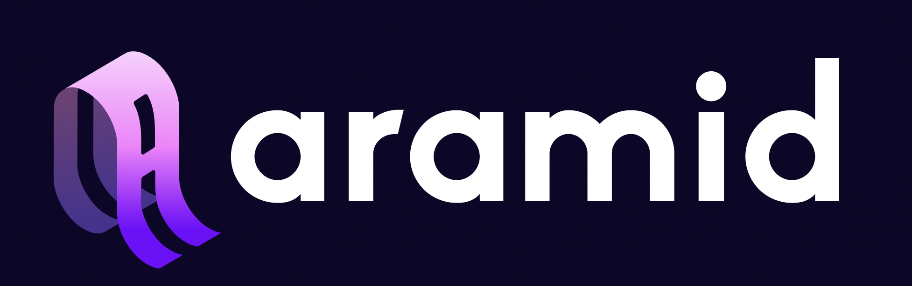

# Aramid Bridge

Aramids Bridge is a decentralized cross-chain bridge covering AVM and EVM-based chains (and soon WASM chains). It bridges assets with a secure, cost-effective and fast communication protocol.

Currently Algorand, Ethereum, Polygon and Aurora are supported. Any EVM can be integrated withing one day with the existing audited infrastructure. In the near future we will be integrating other EVM and non-EVM chains such as NEAR, Cardano, Solana, Polkadot.&#x20;

So, with all that being said, what even is a `decentralized cross-chain bridge`? Let's explore ...
