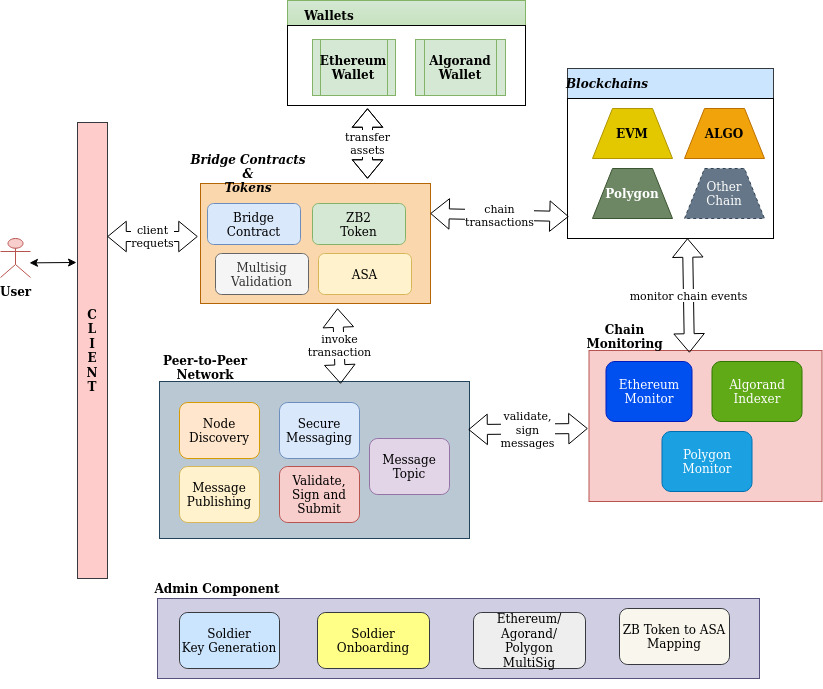

# Protocol

At a high level, this is how the protocol works:

* User sends tokens to the bridge contracts from the source blockchain.
* The bridge, which consists of relayer nodes (we call our nodes Soldiers) watching the blockchain for transactions, logs a new transaction.
* The Soldier nodes then communicate with each other, and come to consensus as to whether or not the new transaction is `valid`.
* It is valid if the current node has also seen this transaction, independently of other nodes.
* If it is valid, they sign the message, and pass it on.
* If enough signatures are found, matching the or exceeding the threshold the transaction is executed on the target blockchain.

> Here are some diagrams which aim to explain the process visually:

> A slightly more in depth diagram, including governance, is displayed below:

`On to the ins and outs of our on-chain assets ...`
