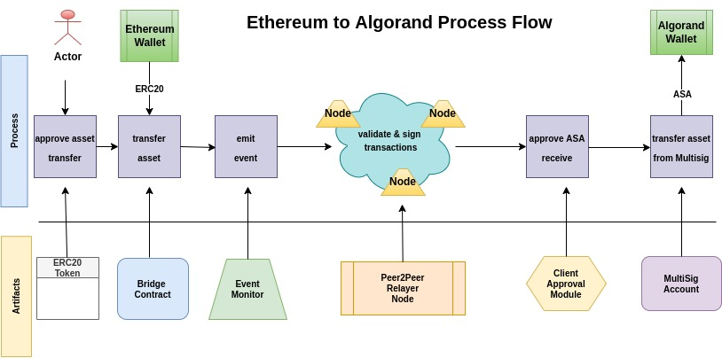
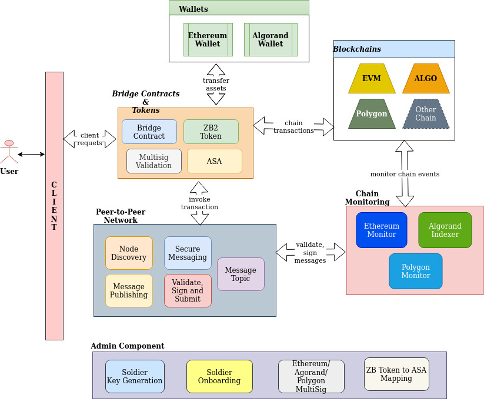

# Protocol

At a high level, this is how the protocol works:

- User sends tokens to the bridge contracts on one of the blockchains.
- The bridge, which consists of many automated nodes watching the blockchain for transactions, logs a new transaction.
- The nodes then communicate with eachother, and come to consensus as to whether or not the new transaction is `valid`.
- It is valid if most of the other nodes have also logged the same transaction.
- If it is valid, they sign the message, and pass it on.
- If enough signatures are found, the transaction is executed on the secondary chain.

Here are some diagrams which aim to explain the process visually.

### Process Flow

The detail steps and its interaction with individual components for an Ethereum to Algorand asset transfer is shown below:

Pictorial representation of different components of Aramid Protocol system is provided below:

