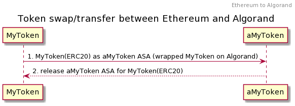
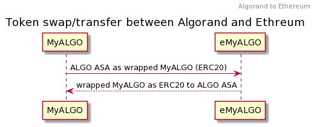

# Concepts

<mark style="color:red;">Explain bridging concepts, current bridging technology, why this technology over others, future plans on using state proofs.</mark>

<mark style="color:red;">Explain concept of generic chain connector</mark>

<mark style="color:red;">Explain Disaster Recovery</mark>

With the advent of Bitcoin in 2009, digital currency became a part of conducting business transactions. In 2013, Ethereum introduced computer Code, also called Smart Contracts, that opened the door for various applications using Blockchain. The smart contract code was written using Solidity/Go languages and executed in an Ethereum Virtal Machine (EVM) environment. Lately, the cost of executing these transactions has been very high due to rise in price of Ethereum currency and there have been challenges with the scalability of the network. This gave rise to many blockchains that addressed these issues such as many EVM compatible chains like Polygon, Binance and Avalanche and many non-EVM chains like Algorand, Celo, Terra and Lukso.&#x20;

Blockchain eco-system grew with many new type of applications such as Digital Identity, Decentralized Finance (DeFi), Yield Farming and craze with Non Fungible Tokens (NFT). Users wanted to move Assets from one chain to another to take advantage of high APR, ease of conducting transaction. Decentralized Exchanges and Bridges filled that need. Decentralized exchanges allowed to swap native Assets from one EVM chain to another EVM chain. Bridges allowed transfer of Assets from one chain to another in an EVM agnostic way.

We asked ourselves many questions from very basic ones like the usability of the Bridge to more intricate ones that centered on the security, reliability of the bridge. We asked:

#### What is the user trying to accomplish when initiating a transaction between the chains?

#### What is the user experience using the Bridge both from a crypto savvy and non-crypto user standpoint?

#### How do we manage transaction cost, speed, usability and reliability of the system?

#### Would we feel safe to use the bridge to transfer a billion dollar bill?

#### How are the infrastructure components (Relayers, Attestors, etc.) compensated?

These questions led us to many discussions and deciding on the architecture of the bridge. We realized that the implementation of a bridge needed to address the trillemma of building any blockchain application: **Security, Scalability and De-centralization**. Unfortunately, solving one of these issues conflicted with the other. So, building a Bridge required accepting these requirements with some assumptions and limitations. There are many ways to build a bridge:&#x20;

* use Atomic swap like Hash Time Locked Contract (HTLC) method.
* use a Trusted custodian, usually a group of trusted resource for added security and de-centralization
* Running a lighter node of a chain in the other chain to conduct on-chain validation

For our TestNet implementation, our scope was to bridge assets among Ethereum, Algorand and Polygon chains. We decided to use the Trusted Custodian approach with a group of Soldiers to validate the transaction. We used the "Lock & Mint" method of transferring tokens between the chains. Users send a native token from their wallet and it appears as a Wrapped Asset in the destination chain.&#x20;

For an Ethereum to Algorand transfer scenario, the user sends a Token (ERC20) from the wallet in Ethereum. The Token is locked in the Bridge Smart contract and a mapped Algorand Standard Asset (ASA) is released from a Multi-Sig account to the user's Algorand wallet. The user can now redeem the ERC20 by initiating a transfer action from Algorand that releases the Token from the Bridge Smart Contract to user Ethereum wallet.

