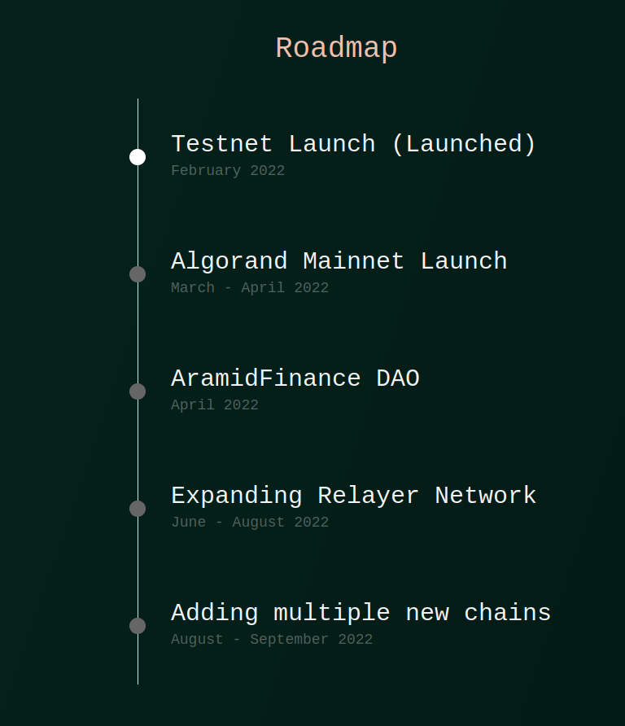

# Roadmap

### **Phase 1 --> The multichain bridge**

<mark style="color:yellow;">**Spring 2022**</mark>

Secure, cost-effective/ efficient, decentralised bridging of native to wrapped assets between Algorand and selected EVM compatible blockchains (Ethereum, Polygon, Lukso,Binance Smart Chain, Celo, Fantom )

### **Phase 2 --> Native bridging**

Add native bridging for assets that have been deployed on multiple chains.

Add other <mark style="color:green;">non-EVM</mark>/<mark style="color:blue;">EVM</mark> complatible blockchains ( <mark style="color:green;">Solana</mark> <mark style="color:blue;">Neon</mark>, <mark style="color:blue;">Polkadot Moonbeam</mark>, <mark style="color:blue;">Near Aurora</mark>, <mark style="color:blue;">Avalanche</mark>, <mark style="color:blue;">Arbitrum</mark>, <mark style="color:blue;">Cronos</mark>, <mark style="color:green;">Terra</mark>, ...)

### Phase 3 -->Cross-chain swapping

### **Phase 4 --> Multi-Chain DEX**

***

***
