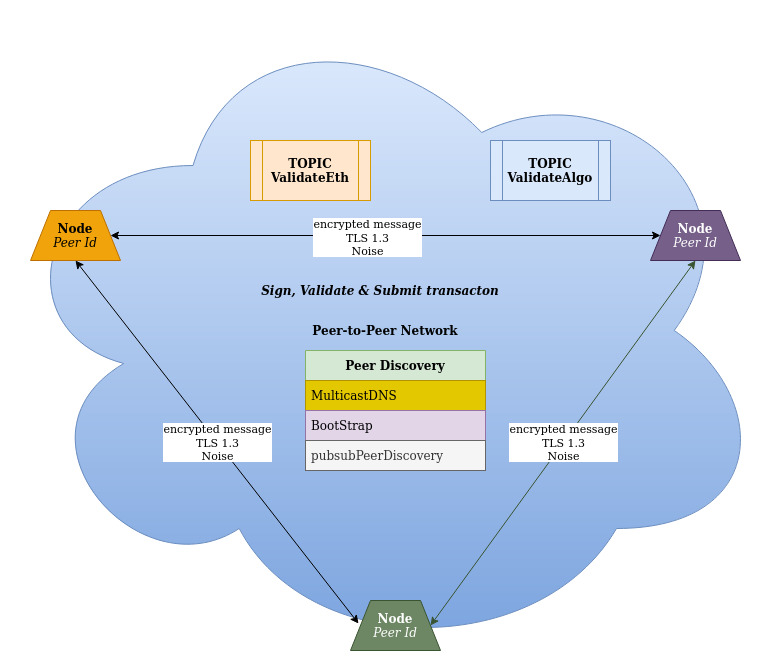

# Soldier Nodes

## Architecture Overview

The so called `soldier network` of validators is a peer-to-peer network where the nodes communicate with one another directly.

Each solider watches a contract/ASA address, and is expecting to see a transaction. For this we use [ethereum event watchers](https://web3js.readthedocs.io/en/v1.3.4/web3-eth-contract.html#contract-events) and the [algorand indexer](https://developer.algorand.org/docs/rest-apis/indexer/).

When a soldier sees a transaction, it leverages the [libp2p networking stack](https://libp2p.io/) for messaging and communication. 

This network transmits messages from one peer to another. It uses public key cryptography as the basis of peer identity. Each node has their unique Peer ID, which allows them to identify each other and communicate among themselves.

When nodes want to communicate with each other, they need to discover other nodes and use their Peer ID to send message.

The network has two topics defined, "validateEth" and "validateAlgo". It uses pubsub interface to verify, sign and send messages to all the peers for defined topics using the extensible gossip protocol "gossipsub".

- When a soldier sees a transaction, it records it, signs it, and then passes the p2p-message to the other soldiers. We use redis for recording the transactions any of our soldiers have recieved.

- When a soldier sees a p2p-message, it queries the blockchain to see if the transaction is valid, and it makes sure it has not yet signed the message.

- If these conditions are met, it then adds it's own signature to the message and propagates the new message to the other peers in the network.

- If a threshold number of soldiers have signed, the transaction will be submitted on-chain in the form of an optimised byte string.

> Misbehaving actors will be removed, using our governance system.

### Incentivization

Soldiers in the system are incentivized to validate the transactions and keep the system safe and secure.

### Disaster Recovery

Each of the soldiers in the network maintain their state in a database. In case of any unforeseen shutdown, they can come online by reading data from their storage medium.

`The audits ...`
