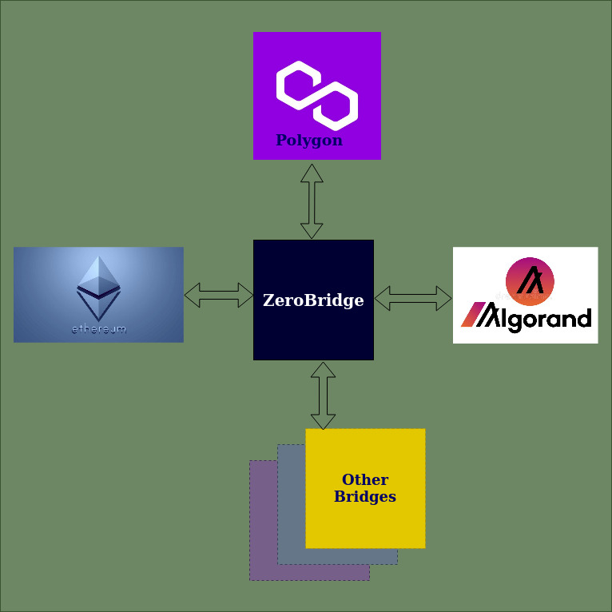

# Introduction

**Aramid** is a decentralized cross chain communication protocol that allows transactions from evm to evm and evm to non-evm blockchains. Our current implementation supports 3-way communication among Ethereum, Algorand and Polygon chains and is deployed in TestNet environments.

### Blockchains: A Quick Overview

A blockchain is a distributed, immuatable, ledger. A history of communication between parties. 

The blockchain ecosystem have grown considerably in the last decade with proliferation of decentralized applications (DApps) with use-cases such as Digital Identity, Decentralized Finance (DeFi), Gaming, Non Fungible Tokens (NFTs) and many more. 

The growth of these blockchains have not been uniform. Ethereum ecosystem has grown considerably in last few years with many DApps across many business domains. However, for others, it has not been so stellar. These blockchains provide benefits and challenges unique to themselves. For example, the cost of executing transactions in Ethereum is very high. In addition, there are challenges with the scalability of the network. 

On the other hand, Algorand, a non-EVM Layer-1 blockchain, has very low transaction fee and higher throughput. Similarly, Polygon, a Layer-2 scaling solution, also has low transaction cost. However, these blockchains and DApps exist as silos and there is very little interaction among them.

### What is a Bridge?

Under the hood, a bridge is a communication protocol. It is an automated software system which listens for information changes in one blockchain, and relays them to a second blockchain. 

These changes are manifested in our bridge as moving assets from one chain to another. If someone holds a Token, say in Ethereum network, they can take advantage of higher APR in a deFi application in Algorand blockchain by sending assets from Ethereum to Algorand chain.

### Main Features of our Bridge

* Evm and non-evm chain communication
* Seamless user interaction
* Permissionless Transfers
* Cryptographically Secure
* Multi-Signature validation and on chain verification
* Non-Custodial

`Next, we will perform such a transfer with paper money ...`
