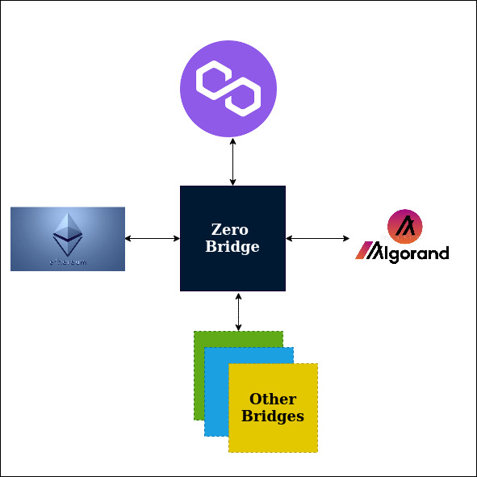

# Introduction

**ZeroBridge** is a decentralized cross chain communication protocol that allows transactions from evm to evm and evm to non-evm blockchains. Our current implementation supports 3-way communication among Ethereum, Algorand and Polygon chains and is deployed in respective TestNet environments.

Follow us on Twitter at @AramidFinance

### Background

In 2009, Bitcoin heralded a new era as the digital currency became a part of conducting business transactions. In May 2010, Florida-based Laszlo Hanyecz spent 10,000 Bitcoins to get two pizzas from a local pizza store called Papa John's. This transaction is known as the first official use of Bitcoin for a commercial transaction with an actual company.

Bitcoin is a decentralized system that stores transactions in a distributed ledger called Blockchain. The transactions are cryptographically verified using a consensus protocol and are immutable. Decentralization, immutability and security features became a foundation for the new wave of applications.

### Ethereum and Smart Contracts

In 2013, Ethereum came up with Smart Contracts, also known as computer code, that allowed business logic to be coded into the transactions. The smart contract code was written using Solidity/Go languages and was executed in an Ethereum Virtal Machine (EVM) environment. Applications developed using smart contracts were called decentralized applications (DApp). The blockchain eco system have grown considerably in the last decade with many new type of DApps such as Digital Identity, Decentralized Finance (DeFi), Gaming, Non Fungible Tokens (NFT) and others.

### Blockchain Ecosystem & Challenges

There have been many different blockchains that use different smart contract languages, consensus protocols and support different DApps for various business domains. These blockchains provide benefits and challenges unique to themselves. For example, the cost of executing transactions in Ethereum is very high. In addition, there are challenges with the scalability of the network. On the other hand, Algorand, a non-EVM Layer-1 blockchain, has very low transaction fee and higher throughput. Similarly, Polygon, a Layer-2 scaling solution, also has low transaction cost. However, these blockchains and DApps exist as silos and there is very little interaction among them.

### Birth of Bridge

The growth of blockchains have not been uniform. Ethereum ecosystem has grown considerably in last few years with many DApps across many business domains. However, for others, it has not been so stellar.

Bridges foster cross-chain communication, moving assets from one chain to other, helping to use DApps from another chain. If someone holds a Token, say in Ethereum network, they can take advantage of higher APR in a deFi application in Algorand blockchain by sending assets from Ethereum to Algorand chain. From that perspective, Bridges play a pivotal role in accelerating the growth of Blockchain ecosystem as a whole.
