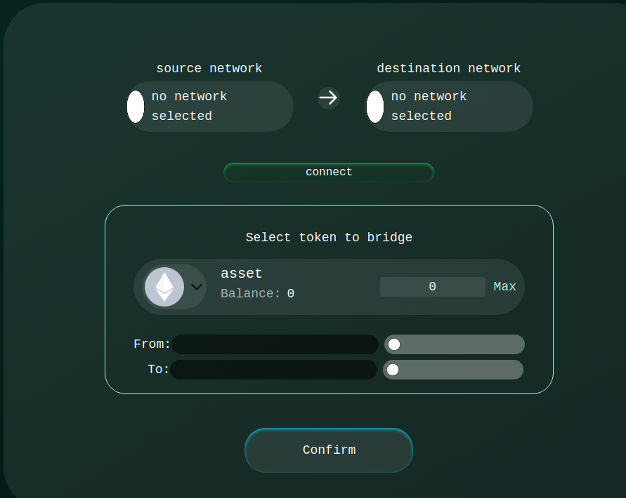

# Zero Bridge Dapp

### Dapp URLs

#### Mainet:

<mark style="color:yellow;">Under construction</mark>

#### Testnet CI/CD release:



#### Testnet UI CI/CD release:

[https://test.zerobridge.xyz/](https://test.zerobridge.xyz)

### Currently supported bridging options

The bridging options have been separated into **non-EVM to non-EVM**, **EVM to non-EVM** and **EVM to EVM** - _Please consider the term EVM as EVM compatible in the docs context_.

#### Non-EVM (focus on Algorand) to EVM (and vice versa) bridging:

* Algorand to Ethereum
* Algorand to Polygon

#### EVM (a) to EVM (b) (and viceversa)

* Ethereum to Polygon

#### Non-EVM to non-EVM (and viceversa)

### Using the WebDapp

1\. Select bridging route

2\. Connect sender and receiver wallets

3\. Select asset to be bridged

#### Note: nothing should go wrong. We have safety mechanisms in place for exception sceanrios. Please visit the Troubleshooting section for your specific issues.
