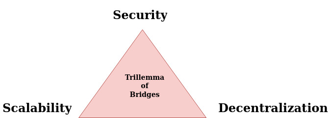
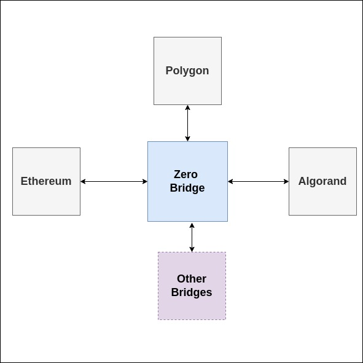
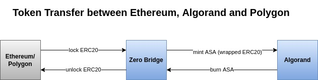

# Zero Bridge

### Bridges and Challenges

Building Bridges is a challenge due to the unique nature of languages and protocols used to implement a blockchain. Typically, blockchains are divided into two different categories: EVM compatibles and non-EVM chains. Among non-EVM chains, each of them are unique in their own way.&#x20;

Bridges connect two different decentralized systems to act as a cohesive whole. That means the requirement for a Bridge is to be decentralized in nature becomes important. The next challenge is to bridge the language and consensus protocol gap. The challenges of building a bridge can be grouped into the trillemma of **Security, Scalability and De-centralization**.

Unfortunately, solving one of the issues conflicts with others. Different bridges have made some adjustments to these requirements with some assumptions and limitations. Current bridges in the market have _security_ issues that slows down the adoption blockchain applications.

## ZERO Bridge

Zero Bridge leads the way by taking a holistic approach to design the system with **Security** being front and centered. A secure system makes people to feel safe to conduct transactions. Before building the Zero Bridge, we asked ourselves many questions from very basic ones like the usability of the Bridge to more intricate ones that centered on the security, reliability of the bridge. We asked:

* What is the user trying to accomplish when initiating a transaction between the chains?
* What should be the user experience for a non-crypto user?
* How do we manage transaction cost, speed, usability and reliability of the system?
* Would we feel safe to use the bridge to transfer millions or billions of money?
* How are the infrastructure components (Relayers, Attestors, etc.) compensated?

These questions led us to many discussions and deciding on the architecture of the bridge. There are many ways to build a bridge:

* use Atomic swap like Hash Time Locked Contract (HTLC) method.
* use a Trusted custodian, usually a group of trusted resource for added security and de-centralization
* Running a lighter node of a chain in the other chain to conduct on-chain validation

### Approach

We decided to use the **Trusted Custodian** approach with a group of **Soldiers** to validate the transaction. We used the **"Lock & Mint"** method of transferring tokens between the chains. Users send a native Token from their wallet and it appears as a Wrapped asset in the destination chain.

&#x20;For our TestNet implementation, our scope was to bridge assets among Ethereum, Algorand and Polygon.&#x20;

### Scenario

For an Ethereum to Algorand transfer scenario, the user sends a Token (ERC20) from the wallet in Ethereum. The Token is locked in the Bridge Smart contract and a mapped Algorand Standard Asset (ASA) is released from a MultiSig account to the user's Algorand wallet. Then, the user can redeem the ERC20 by initiating a transfer action from Algorand that releases the Token from the Bridge Smart Contract to user Ethereum wallet.&#x20;

### Future Implementation

Our future implementation wlil use State Proofs to provide on-chain validation for a complete decentralized bridge.
